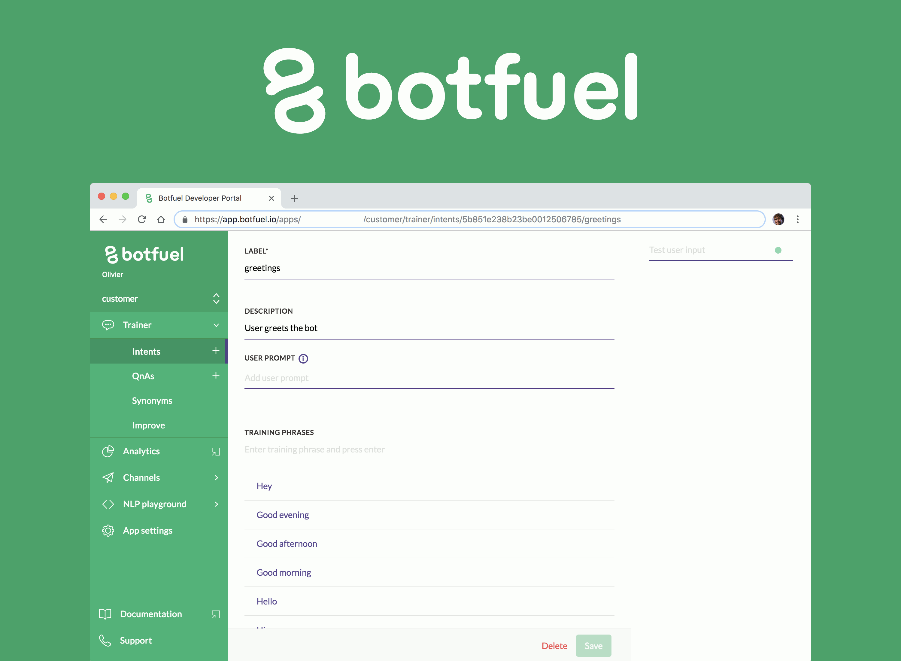
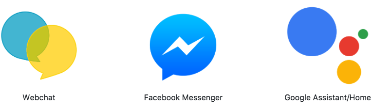
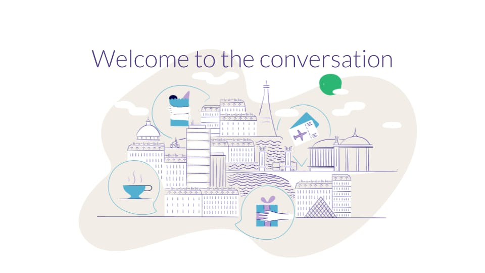

Build highly conversational bots with Botfuel Dialog.

# <a href="https://www.botfuel.io" alt="Botfuel website">Botfuel</a> Dialog 

## What is botfuel-dialog?

Botfuel Dialog is an open source SDK that helps you build highly conversational chatbots using the MVC design pattern on top of Botfuel NLU.

## Follow us

  
  
  

## ❤ Support us

If you like what our developers have built, don't forget to star us on Github. Our team will highly appreciate it!

## Where to start ?

To start using Botfuel, we recommend that you follow our <a href="https://tutorials.botfuel.io/#/codelab/getting-started?step=1" target="_blank">Getting started tutorial</a>. Once you are comfortable, you can continue with the many other <a href="https://tutorials.botfuel.io" target="_blank">tutorials</a>.

If you want to know more about how to use Botfuel, please take a look at our <a href="https://docs.botfuel.io/" target="_blank">documentation</a>, which we are constantly updating.

## Your bot for the most popular platforms

Use one of our adapters or create your own to make your bot compatible with any platform.

  

## Check out our sample bots

Botfuel Dialog comes with <a href="https://github.com/Botfuel/botfuel-dialog/tree/master/packages" target="_blankk">sample bots</a> which also serve as integration tests.

We also provide some standalone <a href="https://github.com/topics/botfuel-demo" target="_blank">sample bots</a> written with Botfuel Dialog. These are used in blog posts and in the documentation.

## Contribute to Botfuel Dialog

If you have any issues or questions, feel free to [open an issue](https://github.com/Botfuel/botfuel-dialog/issues).

In addition to your feedback, we also welcome your contributions. See [our contributing guidelines](./CONTRIBUTING.md).

  

## License

See the [**License**](LICENSE.md) file.
